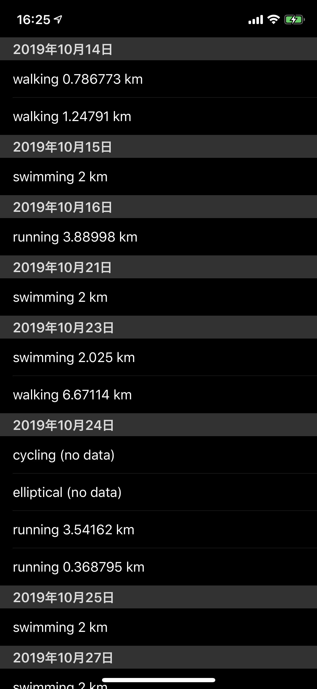
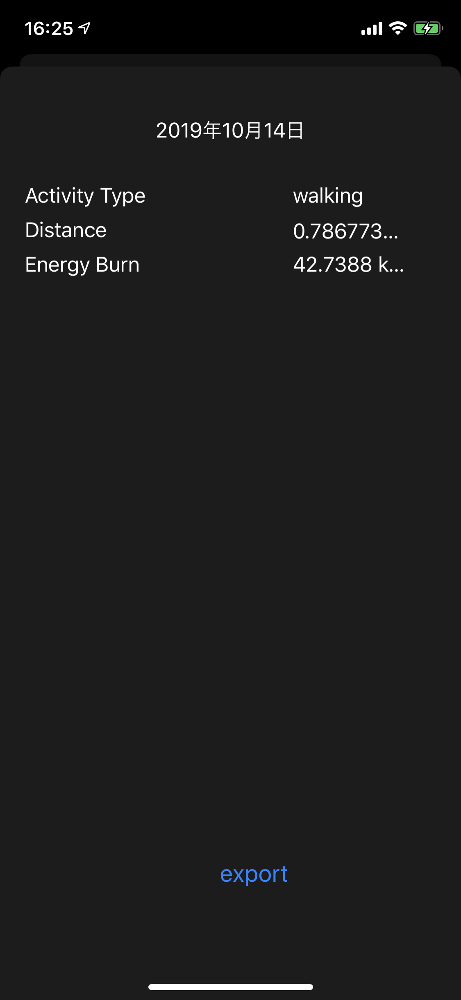
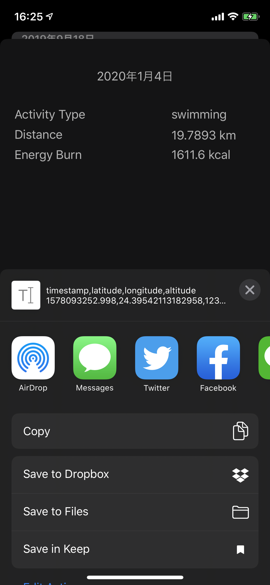

# GeoActivist

GPS trace extractor for Activity.app.





## features

The trace will be extracted as a CSV file.
The columns are:

- `timestamp` as Unix Second
- `latitude`
- `longidude`
- `altitude` in meter

## NOTEs

- ListView

  - 日毎にセクション分けされるテーブルリストですべてのワークアウトを表示する
  - それぞれのワークアウトに対して、以下の情報を表示する

    - 種別
    - 場所（トラックの 1 点目）

  - テーブルビューにはヘッダを作成し、以下のボタンを配置する

    - リフレッシュボタン

- PageView

  - 以下の情報を表示する
    - 種別
    - 記録されているならば距離
    - 消費カロリー
    - 場所(トラックの 1 点目)
    - トラックを地図上に表示
    - csv エクスポートボタン
    - GeoJSON エクスポートボタン

### 処理の流れ

1. didViewLoaded
2. (async) requestPermission
3. (async) query for Workout
4. (async, parallel) query for workoutRoute and workoutAnchor
5. (async) query for Location
6. build Table Compatible Object
7. load data

8. touch to segue (sender: (workout, workoutRoute, workoutAnchor))
9. (async) query for Location (sparse)

10. tohch to export
11. query for Location (all)
12. build csv or GeoJSON
13. airdrop

### Table Compatible Object

```
{
  [YYYYMMDD]: {
    label: "2020年1月10日",
    items: [
      {
        ...workout,
        start: Coord,
      }
     ]
  }
}
```
